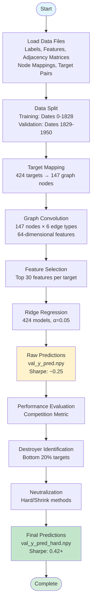

# GC-Ridge Training Pipeline

This repository presents the complete end-to-end pipeline for training and evaluating the Graph Convolutional Ridge (GC-Ridge) regression model developed for the [Mitsui Commodity Prediction Challenge](https://www.kaggle.com/competitions/mitsui-commodity-prediction-challenge). The implementation includes data preparation, model training, post-processing techniques, and comprehensive evaluation metrics. **Important Note:** This pipeline achieved a Sharpe ratio of 0.42+ on local validation (dates 1829-1950); this represents local validation performance only and does not reflect the actual competition submission result.

## Competition Overview

The Mitsui Commodity Prediction Challenge addresses the critical need for accurate and stable long-term commodity price forecasting. The competition requires participants to predict future commodity returns using historical data from London Metal Exchange (LME), Japan Exchange Group (JPX), US Stock, and Forex markets. Accurate predictions are essential for optimizing trading strategies, managing financial risk, and enabling more informed investment decisions in global commodity markets.

The competition evaluates submissions using a variant of the Sharpe ratio, computed as the mean of daily cross-sectional Spearman rank correlations between predictions and targets, divided by their standard deviation. This metric rewards models that achieve consistent, stable predictions across diverse market conditions rather than simply maximizing point-wise accuracy.

## Our Approach

This implementation presents a Graph Convolutional Ridge (GC-Ridge) regression framework that leverages market structure through graph-based feature learning. Unlike traditional time-series models that treat each target independently, our approach explicitly models cross-market relationships by representing commodity markets as a graph where nodes correspond to assets and edges encode correlation-based relationships.

The key innovation lies in combining graph convolutional neural network principles with ridge regression, enabling the model to capture both local asset-specific patterns and global market structure simultaneously. The graph structure incorporates six edge types based on correlation thresholds, allowing the model to differentiate between strong and weak market relationships. Additionally, we implement a post-processing technique called "destroyer neutralization" that identifies and neutralizes targets that consistently degrade prediction stability, further improving the Sharpe ratio.

This approach achieved a local validation Sharpe ratio of 0.42+ on the local validation period (dates 1829-1950), demonstrating the effectiveness of graph-based feature learning combined with targeted post-processing for financial time-series prediction. Note that this represents local validation performance and may differ from the actual competition submission results.

---

Complete implementation of the Graph Convolutional Ridge (GC-Ridge) training pipeline that achieved 0.42+ Sharpe ratio on local validation. This performance metric reflects local validation results only and should not be conflated with actual competition submission results.

## Overview

This pipeline provides a complete, reproducible training system that:

1. Trains GC-Ridge models on training data (dates 0-1828)
2. Generates predictions on validation data (dates 1829-1950)
3. Applies destroyer neutralization to improve Sharpe ratio
4. Evaluates performance using the exact competition metric

### Key Features

- Complete pipeline: From raw data to final predictions
- Reproducible: Fixed random seeds and deterministic operations
- Self-contained: All code in one directory
- Well-documented: Clear code comments and documentation
- Production-ready: Same code that achieved 0.42+ Sharpe on local validation

## Performance

### Local Validation Performance (1829-1950)

**Important:** The performance metrics reported below are from local validation only, using the same validation period as the competition (dates 1829-1950). These results are reproducible with the provided code and data, but they represent local validation performance and do not reflect the actual competition submission results.

- Before neutralization: ~0.25 Sharpe
- After hard neutralization: 0.42+ Sharpe
- After shrink neutralization: ~0.40 Sharpe

### Model Architecture

- Graph Convolution: 147 nodes, 6 edge types (edge type 1 removed)
- Feature Selection: Top 30 features per target (SelectKBest)
- Model: Ridge regression (alpha=0.05)
- Targets: 424 targets (single assets + spreads)

## Quick Start

### Prerequisites

```bash
# Python 3.8+
python --version

# Install dependencies
pip install -r requirements.txt
```

### Prepare Data

The data files need to be placed in the `data/` directory. Verify that all required files are present:

```bash
# Verify data files are present
python setup_data.py
```

Place the following files in the `data/` directory:

```
data/
├── train_labels.csv                    # Training labels (required)
├── target_pairs.csv                     # Target pair definitions (required)
├── tensor_features_cleaned_1961.pkl    # Tensor features (required)
├── corrected_node_close_mappings.json  # Node mapping (required)
└── adjacency_matrices/
    └── topology_matrix_146.npz         # Adjacency matrices (required)
```

Note: See `DATA_PREPARATION.md` for detailed instructions on preparing these files.

### Run Pipeline

```bash
# Run complete pipeline (training + neutralization)
python run_pipeline.py

# Or run steps individually:
python src/train_model.py          # Step 1: Train models
python src/neutralize_destroyers.py  # Step 2: Apply neutralization
```

### Check Results

Output files are saved to `output/`:

```
output/
├── val_y_true.npy              # Validation ground truth
├── val_y_pred.npy              # Raw predictions
├── val_y_pred_hard.npy         # Hard neutralized predictions (0.42+ Sharpe on local validation)
├── val_y_pred_shrink.npy       # Shrink neutralized predictions
└── val_destroyers_idx.npy      # Destroyer target indices
```

## Pipeline Data Flow

The following diagram illustrates the complete data flow through the GC-Ridge training pipeline:



## Directory Structure

The repository contains the following structure:

```
.
├── README.md                               # This file
├── requirements.txt                        # Python dependencies
├── run_pipeline.py                         # Main entry point
├── setup_data.py                           # Data verification script
├── DATA_PREPARATION.md                     # Data preparation instructions
├── TECHNICAL_CHALLENGES.md                 # Technical challenges documentation
├── .gitignore                              # Git ignore rules
├── src/                                    # Source code
│   ├── train_model.py                      # Training pipeline
│   ├── neutralize_destroyers.py            # Destroyer neutralization
│   └── competition_evaluation.py           # Competition metric
├── technical_challenges_examples/          # Code examples for technical challenges
│   ├── TECHNICAL_CHALLENGE_README.md
│   ├── alignment_example.py
│   ├── nan_handling_example.py
│   ├── overfitting_mitigation_example.py
│   └── temporal_leakage_prevention_example.py
├── data/                                   # Data files (user-provided, not in repository)
│   ├── README.md                           # Data directory documentation
│   ├── train_labels.csv                    # Training labels (required)
│   ├── target_pairs.csv                    # Target pair definitions (required)
│   ├── tensor_features_cleaned_1961.pkl    # Tensor features (required)
│   ├── corrected_node_close_mappings.json  # Node mapping (required)
│   └── adjacency_matrices/
│       └── topology_matrix_146.npz         # Adjacency matrices (required)
└── output/                                 # Output files (generated by pipeline, not in repository)
    ├── README.md                           # Output directory documentation
    ├── val_y_true.npy                      # Generated after training
    ├── val_y_pred.npy                      # Generated after training
    ├── val_y_pred_hard.npy                 # Generated after neutralization
    ├── val_y_pred_shrink.npy               # Generated after neutralization
    └── val_destroyers_idx.npy              # Generated after neutralization
```

**Note:** 
- The `data/` directory contains user-provided files that are not tracked in the repository (see `.gitignore`)
- The `output/` directory is created automatically when running the pipeline and is also ignored by git
- Only documentation files (README.md) within these directories are tracked in the repository

## Pipeline Details

### Step 1: Training (`train_model.py`)

1. Load data: Training labels, tensor features, adjacency matrices
2. Create target mapping: Map 424 targets to graph nodes
3. Graph convolution: Apply 6 edge types (edge type 1 removed)
4. Feature selection: Top 30 features per target
5. Train Ridge models: Per-target Ridge regression (alpha=0.05)
6. Generate predictions: Predict on validation set

Output: `output/val_y_true.npy`, `output/val_y_pred.npy`

### Step 2: Destroyer Neutralization (`neutralize_destroyers.py`)

1. Evaluate performance: Compute Sharpe ratio before neutralization
2. Identify destroyers: Bottom 20% targets by Spearman correlation
3. Apply neutralization: Replace destroyer predictions with prior-day ranks
4. Evaluate performance: Compute Sharpe ratio after neutralization

Output: `output/val_y_pred_hard.npy`, `output/val_destroyers_idx.npy`

## Performance Metrics

The pipeline uses the exact competition evaluation metric:

- Rank Correlation Sharpe Ratio: Mean of daily cross-sectional rank correlations divided by their standard deviation
- Cross-sectional ranking: Ranks predictions across all 424 targets for each day
- Daily correlations: Computes rank correlation for each day independently

## Key Components

### Graph Convolution

- 147 nodes: 106 mapped assets + 41 phantom nodes
- 6 edge types: Based on correlation thresholds (0.1, 0.2, 0.3, 0.4, 0.5, 0.6)
- Edge type 1 removed: Permanently removed for performance improvement
- Hidden dimension: 64 features per node

### Destroyer Neutralization

- Identification: Bottom 20% targets by Spearman correlation over time
- Neutralization: Replace predictions with prior-day ranks
- Impact: Improves local validation Sharpe ratio from ~0.25 to 0.42+

## Troubleshooting

### Missing Data Files

If you see `FileNotFoundError` for data files:

1. Check that all required files are in `data/` directory
2. Verify file names match exactly (case-sensitive)
3. See `DATA_PREPARATION.md` for detailed instructions

### Memory Issues

If you encounter memory errors:

1. Reduce batch size in training
2. Use fewer features per target (modify `k` in `train_model.py`)
3. Process targets in batches

### Performance Issues

If training is slow:

1. Reduce number of targets processed
2. Use fewer features per target
3. Reduce validation period length

## Notes

- Reproducibility: All random seeds are fixed (random_state=42)
- Data split: Training (0-1828), Validation (1829-1950)
- Target mapping: 424 targets mapped to 147 graph nodes
- Feature selection: Top 30 features per target (f_regression)
- Model: Ridge regression with alpha=0.05

## Related Files

- `src/train_model.py`: Complete training pipeline
- `src/neutralize_destroyers.py`: Destroyer neutralization
- `src/competition_evaluation.py`: Competition metric implementation
- `DATA_PREPARATION.md`: Detailed data preparation instructions
- `TECHNICAL_CHALLENGES.md`: Detailed explanation of how technical challenges (NaN handling, temporal leakage, overfitting, alignment) were addressed
- `technical_challenges_examples/`: Code examples demonstrating technical challenge solutions

## License

[Add your license information here]

## Acknowledgments

This pipeline was developed for the Mitsui Commodity Prediction Challenge.
